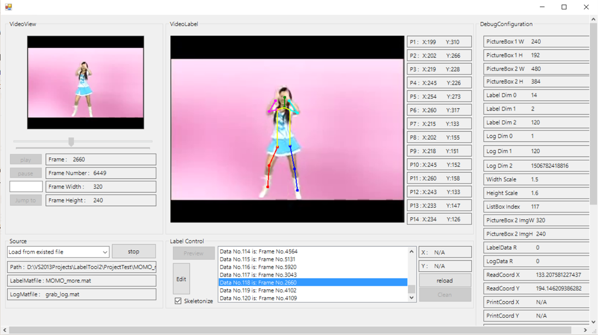

# LabelTool2 
It implements a more powerful GUI tool compared to "LabelTool". It provides visualization of the labeled data and more 
flexible filesystem interface.

#### Platform
This tool is written in c++ under CLR runtime and is a mixed programming with Matlab.

#### Dependencies
- OpenCV REQUIRED (for video reading)
- Matlab (for data processing)

#### Usage
- Load the existing file: Select a folder which includes `LABEL_FILENAME.mat`, `grab_log.mat` and labeling resource and press "load" button
to load the labeling data from `LABEL_FILENAME.mat`. Double-click the labeling data on the list to visualize.
- Output from a new video: Select a video file for labeling. 
  1. Use "play" and "stop" button to select a frame to label or "jump" button to jump.
  2. Press "Edit" to label ("Label" button) the data or modify ("Modi" button) the labeled data.
  
#### Demo
- Choose "Load the existing file" as resource and press "start" button.
- Select "LabelTool2/ProjectTest/MOMO_more/" as input folder.
- Press "Load" and double-click the data in the list.
- Check the checkbox if you want to see skeletonize label.  
The following picture shows the No.118 data. 

